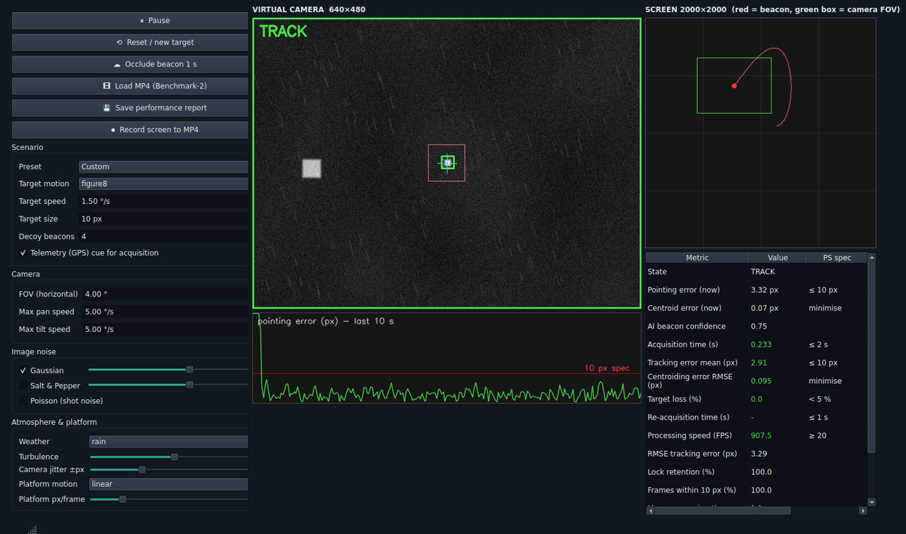
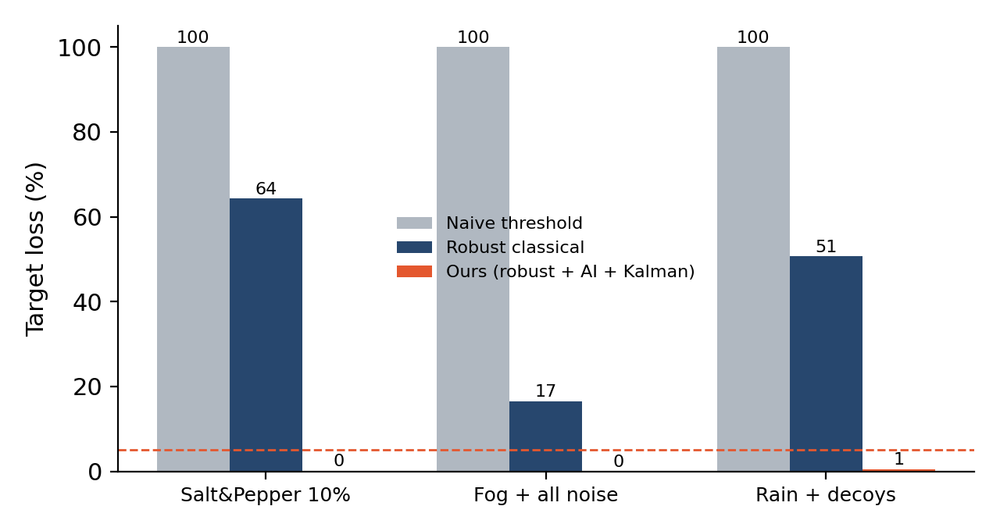

# Photon Lock — AI Virtual Camera Tracking for FSOC Coarse Alignment

**Smart India Hackathon 2026 · Problem Statement SIH26169 (ISRO) · Team Parallax (ID 147721)**

Photon Lock is a software test bench for the coarse **pointing, acquisition and tracking (PAT)** stage of a mobile Free-Space Optical Communication terminal. It simulates a 2000 × 2000 pixel scene, a moving optical beacon and a rate-limited virtual pan/tilt camera (640 × 480, 4° × 3° field of view, 30 Hz), adds every disturbance named in the problem statement (Gaussian, salt-and-pepper and Poisson noise; haze, fog, rain and low light; jitter and platform motion; dropouts and decoy beacons), and then finds, locks and holds the beacon with a robust vision pipeline, a small neural-network beacon verifier and an adaptive Kalman tracker. Every run is scored automatically against the problem statement's limits.



## Run it in three commands

```bash
bash setup.sh                  # macOS / Linux, once  (Windows: .\setup.ps1)
source .venv/bin/activate      # every new terminal   (Windows: .\.venv\Scripts\Activate.ps1)
python gui.py                  # the interactive application
```

A trained AI model is included (`models/beacon_verifier.joblib`), so the GUI works immediately. To watch the AI train on your own machine (about three minutes on a laptop CPU, no GPU):

```bash
python train.py
```

`QUICKSTART.md` is the full user manual for the GUI.

## What is in the repository

| Path | What it is |
|---|---|
| `gui.py` | The application: live simulator, virtual camera, every disturbance adjustable while running, one-click presets, AI / classical / naive detector switch, occlusion and teleport buttons, Benchmark-2 video mode, spec-scored stats table, report export, screen recording. |
| `train.py` | Trains the AI beacon verifier on self-labelled simulator data and prints DATA → TRAIN → TEST → VALIDATE. Writes `models/`. |
| `bench.py` → `summarize.py` → `make_figures.py` | The benchmark suite: 6 target motions × 8 disturbance sets + a beyond-spec STRESS set, an ablation (naive vs classical vs AI) and acquisition trials. Writes `results/` and `docs/fig_*.png`. |
| `app.py` | Headless command line: `sim`, `video` (Benchmark-2), `makevideo` (generate a test clip with ground truth). |
| `tools_make_video.py` | Generates a Benchmark-2 style 2000 × 2000 noisy test video plus its truth CSV. |
| `fsoctrack/sim.py` | Scene, beacon motions (line, circle, figure-8, random, spiral, sine), disturbances, virtual camera. |
| `fsoctrack/vision.py` | Median filter → background removal → matched filter → adaptive (median + 5·MAD) threshold → connected components → sub-pixel centroid → AI verifier. |
| `fsoctrack/tracking.py` | Adaptive constant-acceleration Kalman filter, gating, SEARCH / TRACK / COAST state machine, spiral search, lead controller with slew-rate limit. |
| `fsoctrack/metrics.py` | Per-run performance log and spec scoring (acquisition, tracking error, loss, re-acquisition, FPS). |
| `fsoctrack/session.py`, `runner.py`, `viz.py` | GUI session logic, headless loops, drawing. |
| `models/` | The trained verifier and its training report (34,535 samples, 99.7 % held-out accuracy, 98.3 % recall). |
| `results/` | Benchmark evidence: `benchmark.json` (raw numbers), `summary.json`, `RESULTS.md`, `bench.log`, Benchmark-2 performance report. |
| `docs/` | Figures and screenshots used in the idea deck. |

## Pipeline

| Stage | Method | Why |
|---|---|---|
| Impulse removal | 3 × 3 median (5 × 5 above 15 % impulses) | 10 % salt-and-pepper = 30,720 false pixels per frame against ~100 beacon pixels |
| Background | Local-mean subtraction | Fog and haze lift the whole frame |
| Detection | Gaussian matched filter + median + 5·MAD threshold | Adaptive in every noise and weather condition |
| Centroid | Threshold-subtracted, intensity-weighted | Sub-pixel accuracy: 0.02–0.40 px RMSE |
| AI verifier | MLP (32-16) on 10 blob features, trained on 34.5 k self-labelled simulator blobs | Rejects stars, rain, decoys and residual noise |
| Tracking | Adaptive constant-acceleration Kalman (NIS-driven process noise) + gating | One model for every motion type |
| Control | Aims at the predicted t + 1 position, slew-rate limited | At 5 °/s the pan limit (26.7 px/frame) is close to the ±20 px/frame disturbances |
| Acquisition | Telemetry (GPS) cue + spiral search; SEARCH → TRACK → COAST (≤ 2 s) → cued search | Fast acquisition and re-acquisition after dropouts |

## Measured results (`python bench.py`, 48 in-spec runs, 1-second dropout every 4 s)

| PS requirement | Limit | Measured |
|---|---|---|
| Acquisition time | ≤ 2 s | max 1.07 s (median 0.63 s with telemetry cue) |
| Tracking error | ≤ 10 px | median 3.6 px |
| Centroid accuracy | — | 0.13 px RMSE mean (0.02–0.40) |
| Target loss | < 5 % | mean 1.0 % (two amber runs: random motion in rain 20.1 %, in fog 16.2 %) |
| Re-acquisition | ≤ 1 s | 137 of 144 one-second dropouts re-locked ≤ 1 s |
| Processing speed | ≥ 20 FPS | ≥ 300 FPS on a laptop CPU |

46 of 48 in-spec scenarios pass every specification. The beyond-spec STRESS set (±20 px jitter and 20 px/frame platform motion together) is **not** solved yet (36–53 % loss) and is the finale target. Ablation on the hard scenes: naive threshold 100 % loss, classical pipeline 43.8 %, full AI pipeline 0.2 %. Full table in `results/RESULTS.md`; raw numbers in `results/benchmark.json`.



## Reproduce everything

```bash
python train.py                                   # retrain the verifier (~3 min)
python bench.py && python summarize.py && python make_figures.py   # full benchmark (~4 min)
python app.py makevideo --out bench_test.mp4 --seconds 10          # Benchmark-2 test clip + truth CSV
python app.py video --input bench_test.mp4                         # score it headless
```

Runs are seeded, so the numbers above are repeatable.

## Standalone executable (optional)

```bash
pip install pyinstaller
pyinstaller --onefile --windowed --add-data "models:models" gui.py      # Windows: "models;models"
```

## Links

- Demo video: *(YouTube link)*
- Idea deck: *(PDF in the submission portal)*
